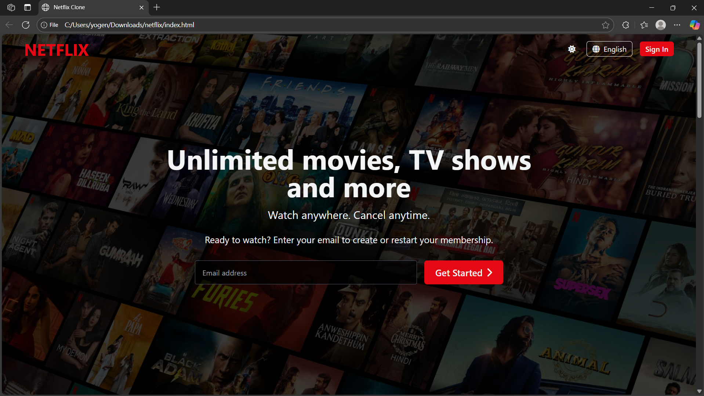
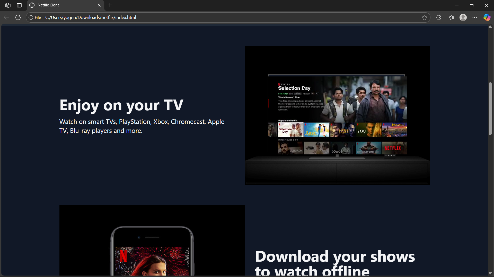
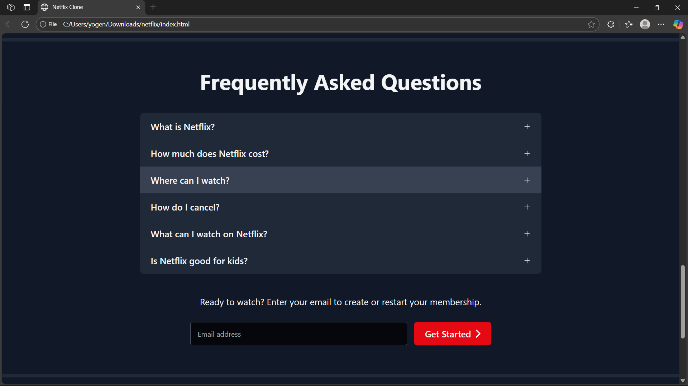

# 🎬 Netflix Clone - Modern Streaming Platform

[](https://app.netlify.com/sites/YOUR_SITE_NAME/deploys)

A responsive Netflix clone built with modern web technologies, featuring a beautiful UI and smooth user experience. This project replicates the core functionality and design of the popular streaming platform.

## ✨ Features

- 🎥 **Hero Section** with trending movies background
- 📱 **Fully Responsive** design for all devices
- 🔍 **Interactive FAQ** section with collapsible answers
- 📺 **Device Compatibility** showcase
- ✉️ **Email Sign-up** functionality
- ⚡ **Lightning Fast** performance

## 🖼️ Screenshots

### 1. Hero Section

*Landing page featuring trending movies background and email sign-up*

### 2. Features Showcase

*Highlighting platform compatibility across various devices*

### 3. FAQ Section

*Interactive FAQ with collapsible answers*

## 🛠️ Technologies Used

- **Frontend**: HTML5, CSS3, JavaScript (ES6+)
- **Icons**: Font Awesome
- **Fonts**: Netflix Sans (Custom Font)
- **Deployment**: Netlify

## 🚀 Getting Started

1. **Clone the repository**
   ```bash
   git clone https://github.com/yourusername/netflix-clone.git
   cd netflix-clone
   ```

2. **Open in browser**
   Simply open `index.html` in your preferred web browser

## 🎯 Features in Detail

### Hero Section
- Dynamic background with trending content
- Eye-catching call-to-action
- Email validation for sign-up

### Device Compatibility
- TV
- PlayStation
- Xbox
- Chromecast
- Smart TVs
- Mobile & Tablet

### FAQ Section
- Interactive toggle functionality
- Clean and intuitive design
- Easy navigation

## 🤝 Contributing

Contributions are welcome! Please feel free to submit a Pull Request.

1. Fork the repository
2. Create your feature branch (`git checkout -b feature/AmazingFeature`)
3. Commit your changes (`git commit -m 'Add some AmazingFeature'`)
4. Push to the branch (`git push origin feature/AmazingFeature`)
5. Open a Pull Request

## 📄 License

This project is licensed under the MIT License - see the [LICENSE](LICENSE) file for details.

## 🙏 Acknowledgments

- Netflix for the design inspiration
- All open-source contributors
- Online learning resources

